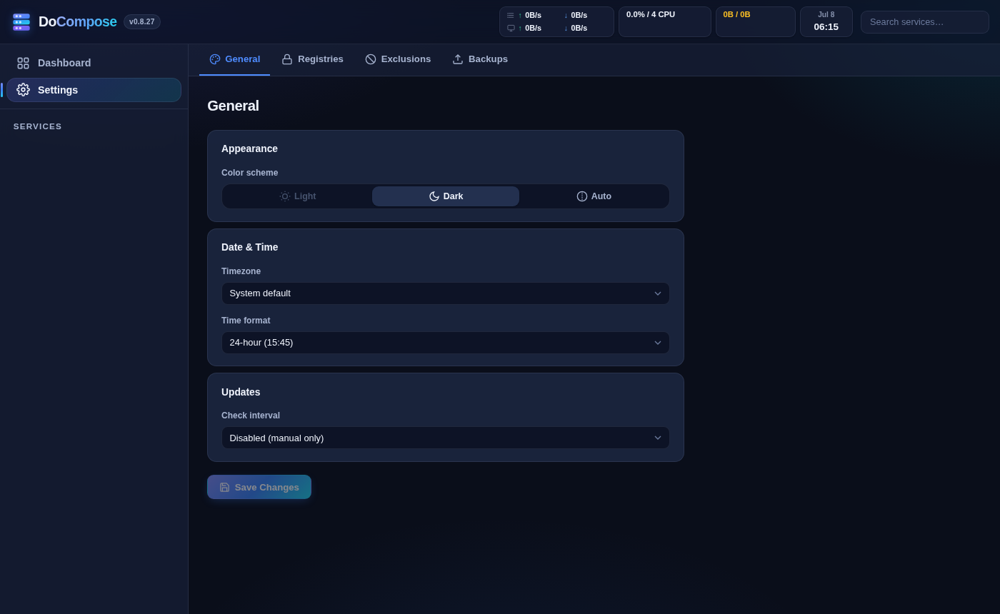

# DoCompose

**DoCompose** is a self-hosted web app for managing Docker Compose projects from your browser — start, stop, update, and monitor all your containers without touching the command line.



---

## Features

- **Live service dashboard** — See all containers at a glance with real-time status, health indicators, and host-level CPU, memory, and network stats.
- **Per-container controls** — Start, stop, restart, recreate, and remove individual containers with a single click. Recreate redirects straight to the live log stream.
- **Image update detection** — Check any container for a newer image version against the registry without pulling first. Supports private registries with stored credentials.
- **One-click image updates** — Pull the latest image and force-recreate the container in one action. DoCompose can even update itself and reconnect the browser automatically.
- **Integrated log viewer** — Stream container logs in real time directly from the browser, with filtering and auto-scroll.
- **Built-in terminal** — Open an interactive shell inside any running container without leaving the UI.
- **YAML configuration editor** — Edit `docker-compose.yml` with syntax highlighting, auto-format, and intelligent indentation repair that fixes common paste errors.
- **Environment variable editor** — View and edit `.env` files alongside your Compose configuration.
- **Cloud backups** — Schedule automated backups of container data to OneDrive or Dropbox, with retention management and timezone-aware folder naming.
- **GUI backup scheduler** — Set backup schedules with a friendly picker (hourly / daily / weekly / custom cron) — no cron syntax required.
- **Private registry support** — Store credentials for multiple private registries; used automatically for update checks and image pulls.
- **Project exclusions** — Hide specific compose projects from the dashboard to keep things tidy.
- **Global search** — Search across service names, images, ports, volumes, and environment variables instantly.
- **Dark / light / auto mode** — Follows your system preference by default; manually togglable at any time.
- **Mobile-friendly** — Fully functional on phone and tablet, not just desktop.
- **Self-hosted, no login required** — Intended for trusted network / reverse-proxy deployments.

---

## Getting Started

Add DoCompose to your `docker-compose.yml`:

```yaml
services:

  docompose:
    image: ghcr.io/claudeailab/docompose
    container_name: docompose
    hostname: docompose
    restart: unless-stopped
    user: "0"
    environment:
      TZ: ${TZ}
    ports:
      - 8094:8094
    volumes:
      - /var/run/docker.sock:/var/run/docker.sock
      - /path/to/your/compose/projects:/compose
```

Start it:

```bash
docker compose up -d docompose
```

Open `http://your-host:8094` in your browser.

> **Tip:** Mount the directory that contains all your compose projects as `/compose`. DoCompose will discover each subdirectory automatically.

---

## Updating

```bash
docker compose pull docompose && docker compose up -d docompose
```

Or use the **Update** button in DoCompose itself — it will pull the new image, recreate the container, and reload the browser automatically once the new version is running.
